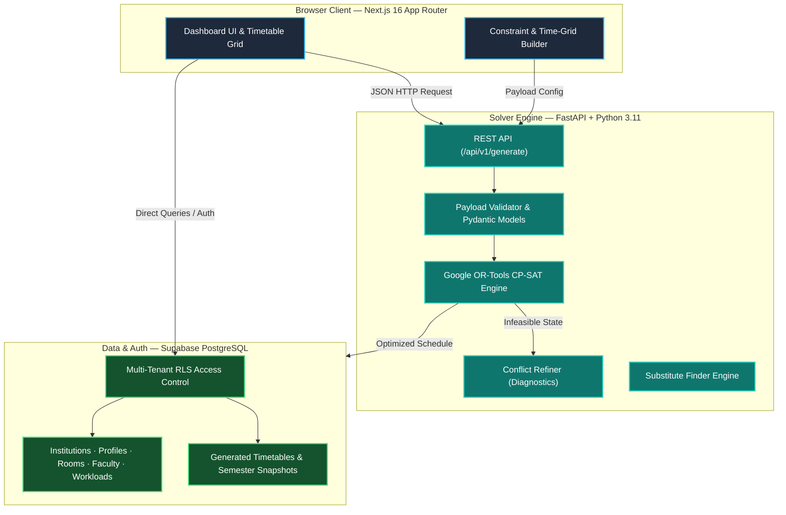

# ShiftSync — AI-Driven College Timetable Generator

<p align="center">
  
  
  
  
  
  
  
</p>

> Intelligent, constraint-aware timetable generation powered by Google OR-Tools CP-SAT, FastAPI, and Next.js 16.

---

##  System Overview

**ShiftSync** is an enterprise-grade SaaS platform designed for educational institutions to automate weekly timetable generation. The system orchestrates a **Next.js 16** web application, a **FastAPI** constraint solver engine utilizing **Google OR-Tools CP-SAT**, and a **Supabase (PostgreSQL)** database enforcing multi-tenant Row Level Security (RLS).

---

##  System Architecture



---

##  Core Capabilities

### Constraint Satisfaction Engine (CP-SAT)
- Enforces multi-dimensional hard constraints: shift compliance, room allocation, lab continuity, parent-child batch conflicts, and faculty workload bounds.

### Ghost Resource Layer
- Implements dynamic overflow management to prevent solver `INFEASIBLE` states when physical room capacity is constrained.

### Bottleneck Diagnostics & Conflict Refiner
- Provides human-readable diagnostic analysis pinpointing exact constraint collisions during unsolvable scheduling scenarios.

### Faculty Substitution Engine
- Performs real-time, conflict-aware matching to identify eligible substitute faculty for unassigned lecture slots.

### Google Calendar Synchronization
- Integrates OAuth 2.0 protocol for automated export of generated schedules into Google Calendar.

### Multi-Tenant Architecture & Security
- Enforces strict institutional data isolation via Supabase PostgreSQL Row Level Security (RLS) policies.

---

##  Technology Stack

<table>
  <tr>
    <td align="center" width="160">
      <br />
      <b>Next.js 16</b>
    </td>
    <td align="center" width="160">
      <br />
      <b>TypeScript</b>
    </td>
    <td align="center" width="160">
      <br />
      <b>Tailwind CSS</b>
    </td>
    <td align="center" width="160">
      <br />
      <b>Python 3.11</b>
    </td>
  </tr>
  <tr>
    <td align="center" width="160">
      <br />
      <b>FastAPI</b>
    </td>
    <td align="center" width="160">
      <br />
      <b>Supabase</b>
    </td>
    <td align="center" width="160">
      <br />
      <b>PostgreSQL</b>
    </td>
    <td align="center" width="160">
      <br />
      <b>Google OR-Tools</b>
    </td>
  </tr>
</table>

---

##  Environment Setup

### Prerequisites
- Node.js 20+
- Python 3.11+
- Supabase Project Instance

### 1. Repository Setup
```bash
git clone https://github.com/AshrafGalaxy/Shift_Sync.git
cd Shift_Sync
```

### 2. Backend Engine Installation
```bash
cd backend
python -m venv venv

# Windows
venv\Scripts\activate
# macOS/Linux
source venv/bin/activate

pip install -r requirements.txt
uvicorn main:app --reload --port 8000
```

### 3. Frontend Web Client Installation
```bash
cd ../frontend
npm install
```

Configure `frontend/.env.local`:
```env
NEXT_PUBLIC_SUPABASE_URL=https://your-project.supabase.co
NEXT_PUBLIC_SUPABASE_ANON_KEY=your-anon-key
NEXT_PUBLIC_ENGINE_URL=http://localhost:8000

# Optional — Google Calendar OAuth Integration
NEXT_PUBLIC_GOOGLE_CLIENT_ID=your-google-client-id
GOOGLE_CLIENT_SECRET=your-google-client-secret
```

Launch development environment:
```bash
npm run dev
```

### 4. Database Schema Migration
Execute `supabase_schema.sql` in the Supabase SQL Editor.

---

##  Engine Testing & Verification

Run backend unit tests:
```bash
cd backend
pytest tests/ -v
```

---

##  Copyright Notice

Copyright © 2026 Ashraf. All Rights Reserved.
